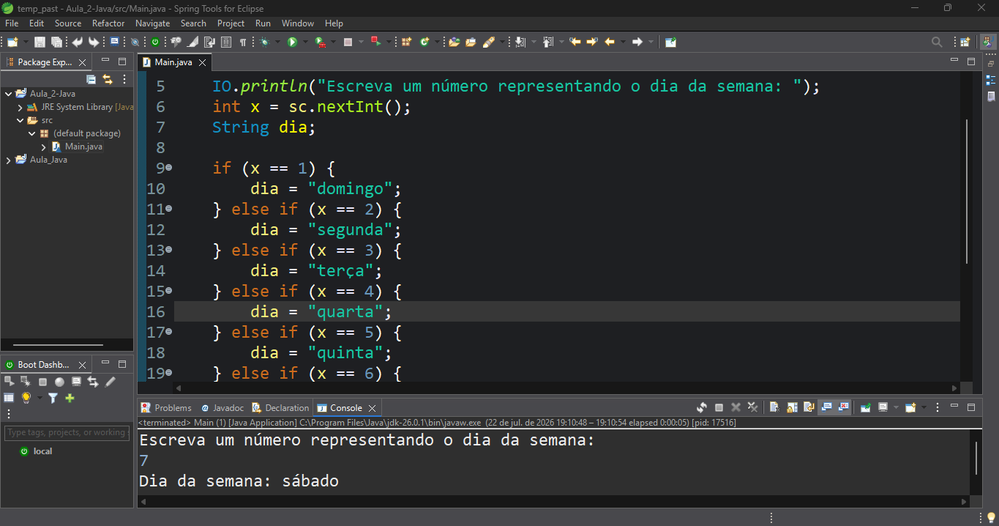
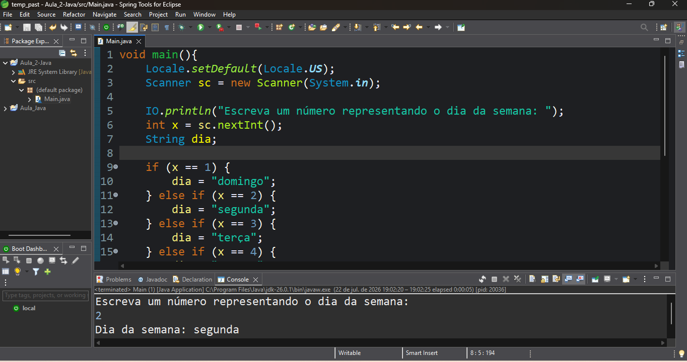

# 📅 Exercício Java: Dias da Semana

Um programa simples em Java que utiliza a estrutura condicional `if-else` para determinar o dia da semana com 
base em um número inteiro fornecido pelo usuário.

## 🚀 Sobre o Projeto
Este exercício tem como objetivo demonstrar comandos básicos da linguagem Java, com foco na lógica de programação 
condicional. Os principais conceitos aplicados são:

*   **Entrada de dados:** Utilização da classe `Scanner` para ler entradas via teclado.
*   **Controle de Fluxo:** Aplicação de blocos `if`, `else if` e `else` para tomadas de decisão estruturadas.
*   **Variáveis e Strings:** Atribuição e concatenação de textos na saída do console.

**Como funciona?** 
O usuário digita um número de `1` a `7` e o programa imprime o dia correspondente (onde `1 = domingo`, `2 = segunda-feira`, etc.). 
Se um número fora desse intervalo for inserido, o sistema avisa que é um "Valor inválido".

*(Nota: O código utiliza `System.out.println` como o padrão do Java, adaptado da classe auxiliar `IO` utilizada no ambiente local).*

## 📸 Demonstração
Abaixo está a execução do código no console, demonstrando a entrada do valor e a resposta correta do sistema:

